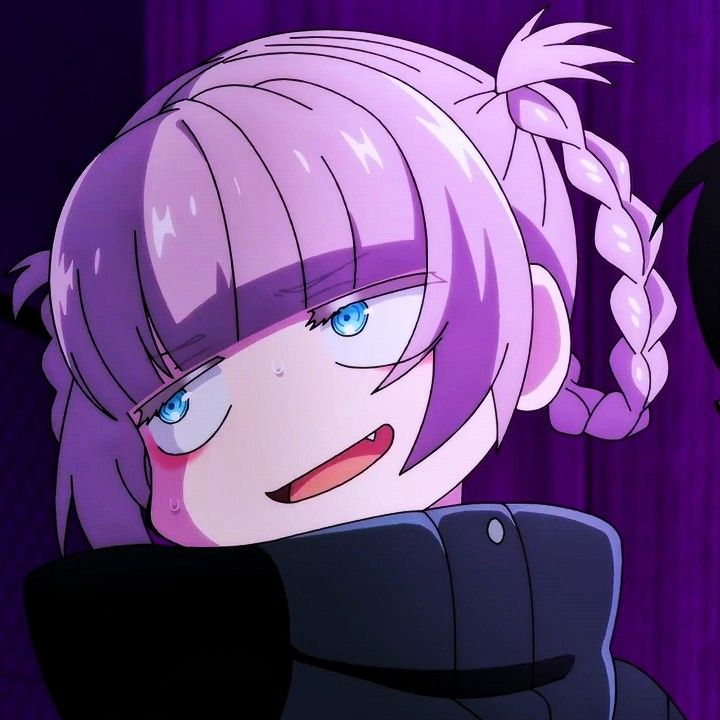

<p align="center">
 
 <h1 align="center">Nazuna Nanakusa</h1>
 <h3 align="center">m00nbek's assistant</h3>
</p>

## Setup
1. Install [node](https://nodejs.org)
2. Set up your [.env](.env.sample)
```env
APP_ID=<YOUR_APP_ID>
GUILD_ID=<YOUR_GUILD_ID>
DISCORD_TOKEN=<YOUR_BOT_TOKEN>
PUBLIC_KEY=<YOUR_PUBLIC_KEY>
```
3. Install the dependencies
```
npm install
```
4. Start the bot
```
npm run dev
```

